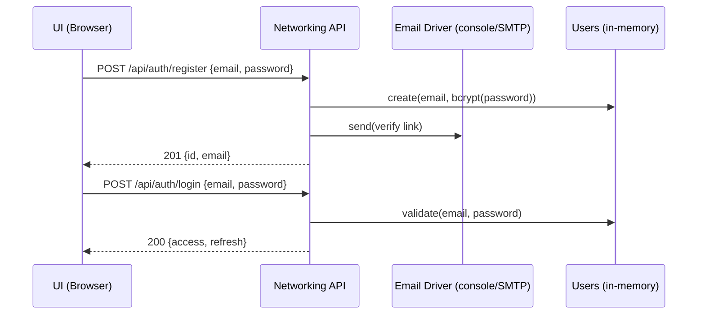
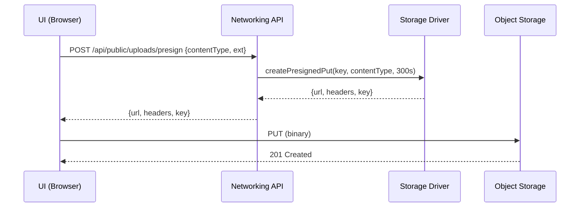
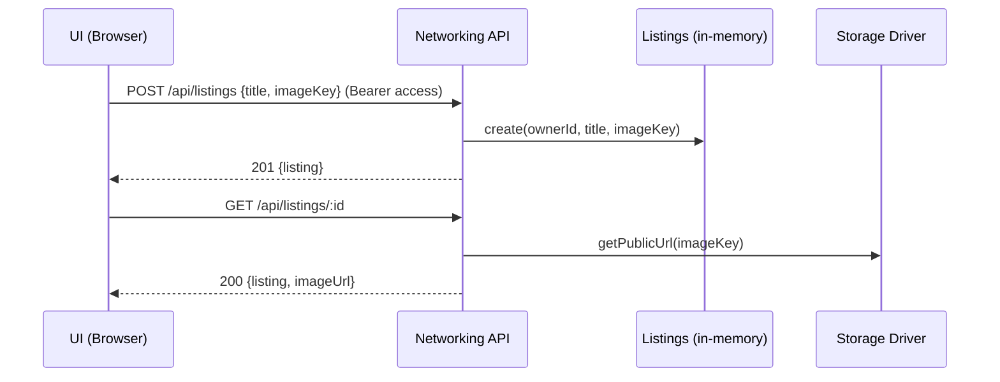

# FNK Networking Service

A standalone, pluggable networking/API layer for **FindersNotKeepers**. It can run by itself for demos and testing, and it exposes a stable REST surface so your web UI and other services can integrate without code churn.

> Tech: TypeScript, Express, JWT, Helmet/CORS, rate-limits, pluggable **Storage** (local→S3) & **Email** (console→SMTP) drivers.

---

## Table of Contents
- [Architecture](#architecture)
- [Quick Start](#quick-start)
- [Configuration](#configuration)
- [Security Posture](#security-posture)
- [API Overview](#api-overview)
- [OpenAPI Spec](#openapi-spec)
- [Request Flows](#request-flows)
- [Data Model](#data-model)
- [Production Swaps](#production-swaps)
- [License](#license)

---

## Architecture

### Context & Containers (C4)
```mermaid
flowchart LR
    subgraph Client[Clients]
      A[Browser / UI]
      B[Mobile or Script]
    end

    subgraph Edge[Edge: CDN/WAF/Reverse Proxy]
      WAF[WAF + TLS Termination]
    end

    subgraph SVC[Networking Service]
      API[Express API\nAuth / Public / Listings]
      SEC[Security Middleware\n(Helmet, CORS, Rate-limit)]
      AUTH[JWT Service]
      DRV1[Storage Driver\n(local→S3)]
      DRV2[Email Driver\n(console→SMTP)]
    end

    subgraph Data[Data Stores]
      MEM[(In-memory Users\n& Listings)]
      OBJ[(Object Storage\nLocal dir→S3)]
      SMTP[(SMTP Relay)]
    end

    A-->WAF-->API
    B-->WAF

    API-->SEC
    API-->AUTH
    API-->MEM
    API-->DRV1-->OBJ
    API-->DRV2-->SMTP
```

---

## Quick Start

```bash
# 1) Install
cp .env.example .env
npm i

# 2) Run (dev)
npm run dev

# 3) Smoke test
curl -s http://localhost:8080/api/public/health | jq
```

### Typical Dev Flow
1. **Register** → **Login** to get tokens
2. **Presign** upload → PUT file to returned URL
3. **Create listing** referencing `imageKey`
4. **Get listing** → (optional) `imageUrl` if storage supports it

---

## Configuration

Set via environment variables (see `.env.example`).

| Variable | Default | Notes |
|---|---:|---|
| `PORT` | `8080` | HTTP port |
| `ALLOWED_ORIGINS` | `http://localhost:5173,http://localhost:3000` | CSV list for CORS allowlist |
| `HSTS_ENABLED` | `true` | Add Strict-Transport-Security (dev only simulates) |
| `REQUEST_BODY_LIMIT_MB` | `6` | Caps JSON/form bodies (upload bytes go to object storage) |
| `JWT_ISSUER` / `JWT_AUDIENCE` | `fnk.network` / `fnk.web` | Verify audience/issuer on tokens |
| `JWT_ACCESS_TTL` / `JWT_REFRESH_TTL` | `3600` / `1209600` | Seconds |
| `JWT_SECRET` | `dev_only_replace_me` | Use a proper secret in prod |
| `STORAGE_DRIVER` | `local` | `local` for dev, `s3` for prod |
| `LOCAL_STORAGE_DIR` | `.uploads` | Private dev storage |
| `EMAIL_DRIVER` | `console` | `console` or `smtp` |
| `SMTP_*` | – | Configure when `EMAIL_DRIVER=smtp` |
| `ADMIN_IP_ALLOWLIST` | `127.0.0.1/32` | For future admin-only routes |

---

## Security Posture
- **TLS/HSTS**: Edge in prod; Helmet in dev.
- **CORS**: explicit allowlist via `ALLOWED_ORIGINS`.
- **Headers**: Helmet (CSP, X-Content-Type-Options, Referrer-Policy, etc.).
- **Rate-limits**: `express-rate-limit` (tune per route; auth endpoints can be tighter).
- **Body caps**: `REQUEST_BODY_LIMIT_MB` (e.g., align with `<5 MB` image rule + headroom).
- **JWT**: short-lived access, long-lived refresh.
- **Uploads**: done via presigned PUT; API stores only metadata (no file bytes through API).

---

## API Overview

Base URL (dev): `http://localhost:8080`

### Public
- `GET /api/public/health` → service status
- `POST /api/public/uploads/presign` → presigned PUT target `{ contentType, ext? }`

### Auth
- `POST /api/auth/register` → create user, send verification email
- `POST /api/auth/login` → issue `{ access, refresh }`
- `POST /api/auth/refresh` → exchange refresh → `{ access }`

### Listings
- `GET /api/listings` → list all (demo)
- `POST /api/listings` *(Bearer access)* → create
- `GET /api/listings/{id}` → detail (+`imageUrl` if supported)
- `DELETE /api/listings/{id}` *(owner)* → delete

### cURL Examples
```bash
# Register
curl -X POST http://localhost:8080/api/auth/register \
  -H 'Content-Type: application/json' \
  -d '{"email":"a@b.com","password":"pass"}'

# Login → capture tokens
ACCESS=$(curl -s -X POST http://localhost:8080/api/auth/login \
  -H 'Content-Type: application/json' \
  -d '{"email":"a@b.com","password":"pass"}' | jq -r .access)

# Presign upload
PS=$(curl -s -X POST http://localhost:8080/api/public/uploads/presign \
  -H 'Content-Type: application/json' \
  -d '{"contentType":"image/jpeg","ext":"jpg"}')
URL=$(echo "$PS" | jq -r .url); TOKEN=$(echo "$PS" | jq -r .headers["x-local-upload-token"]); KEY=$(echo "$PS" | jq -r .key)

# Dev-only upload (pseudo-presign)
curl -X PUT "http://localhost:8080$URL" -H "x-local-upload-token: $TOKEN" --data-binary @sample.jpg

# Create listing
curl -s -X POST http://localhost:8080/api/listings \
  -H "Authorization: Bearer $ACCESS" -H 'Content-Type: application/json' \
  -d "{\"title\":\"Red backpack\",\"imageKey\":\"$KEY\"}"
```

---

## OpenAPI Spec

> Copy into Swagger UI/Redoc, or generate clients.

```yaml
openapi: 3.1.0
info:
  title: FNK Networking API
  version: 0.1.0
servers:
  - url: http://localhost:8080
paths:
  /api/public/health:
    get:
      summary: Liveness/health
      responses:
        '200':
          description: OK
          content:
            application/json:
              schema:
                type: object
                properties:
                  status: { type: string }
                  env: { type: string }
                  time: { type: string, format: date-time }
  /api/public/uploads/presign:
    post:
      summary: Get a presigned PUT target for object upload
      requestBody:
        required: true
        content:
          application/json:
            schema:
              type: object
              required: [contentType]
              properties:
                contentType: { type: string }
                ext: { type: string, description: File extension without dot }
      responses:
        '200':
          description: Presigned info
          content:
            application/json:
              schema:
                type: object
                properties:
                  key: { type: string }
                  url: { type: string }
                  headers:
                    type: object
                    additionalProperties: { type: string }
  /api/auth/register:
    post:
      summary: Register a user (sends verification email)
      requestBody:
        required: true
        content:
          application/json:
            schema:
              type: object
              required: [email, password]
              properties:
                email: { type: string, format: email }
                password: { type: string, format: password }
      responses:
        '201':
          description: Created
          content:
            application/json:
              schema:
                type: object
                properties:
                  id: { type: string }
                  email: { type: string }
        '409': { description: Email exists }
  /api/auth/login:
    post:
      summary: Login and get tokens
      requestBody:
        required: true
        content:
          application/json:
            schema:
              type: object
              required: [email, password]
              properties:
                email: { type: string, format: email }
                password: { type: string, format: password }
      responses:
        '200':
          description: Tokens
          content:
            application/json:
              schema:
                type: object
                properties:
                  access: { type: string }
                  refresh: { type: string }
        '401': { description: Invalid credentials }
  /api/auth/refresh:
    post:
      summary: Exchange refresh for a new access token
      requestBody:
        required: true
        content:
          application/json:
            schema:
              type: object
              required: [refresh]
              properties:
                refresh: { type: string }
      responses:
        '200':
          description: New access token
          content:
            application/json:
              schema:
                type: object
                properties:
                  access: { type: string }
        '401': { description: Invalid refresh }
  /api/listings:
    get:
      summary: List listings
      responses:
        '200':
          description: OK
          content:
            application/json:
              schema:
                type: object
                properties:
                  items:
                    type: array
                    items:
                      $ref: '#/components/schemas/Listing'
    post:
      summary: Create a listing (requires Bearer access)
      security: [{ bearerAuth: [] }]
      requestBody:
        required: true
        content:
          application/json:
            schema:
              type: object
              required: [title]
              properties:
                title: { type: string }
                description: { type: string }
                imageKey: { type: string }
      responses:
        '201': { description: Created, content: { application/json: { schema: { $ref: '#/components/schemas/Listing' } } } }
        '400': { description: Bad request }
        '401': { description: Unauthorized }
  /api/listings/{id}:
    get:
      summary: Get single listing
      parameters:
        - in: path
          name: id
          required: true
          schema: { type: string }
      responses:
        '200': { description: OK, content: { application/json: { schema: { $ref: '#/components/schemas/ListingDetail' } } } }
        '404': { description: Not found }
    delete:
      summary: Delete listing (owner only)
      security: [{ bearerAuth: [] }]
      parameters:
        - in: path
          name: id
          required: true
          schema: { type: string }
      responses:
        '204': { description: Deleted }
        '403': { description: Forbidden }
        '404': { description: Not found }
components:
  securitySchemes:
    bearerAuth:
      type: http
      scheme: bearer
      bearerFormat: JWT
  schemas:
    Listing:
      type: object
      properties:
        id: { type: string }
        ownerId: { type: string }
        title: { type: string }
        description: { type: string, nullable: true }
        imageKey: { type: string, nullable: true }
        createdAt: { type: string, format: date-time }
    ListingDetail:
      allOf:
        - $ref: '#/components/schemas/Listing'
        - type: object
          properties:
            imageUrl: { type: string, nullable: true }
```

---

## Request Flows

### Register/Login


### Presigned Upload


### Create/Get Listing


---

## Data Model

```mermaid
erDiagram
  USER ||--o{ LISTING : owns
  USER {
    string id PK
    string email
    string passwordHash
    boolean emailVerified
    datetime createdAt
  }
  LISTING {
    string id PK
    string ownerId FK -> USER.id
    string title
    string description
    string imageKey
    datetime createdAt
  }
```

---

## Production Swaps
- **Storage Driver** → implement S3 presign + `getPublicUrl`, put behind CDN.
- **Email Driver** → configure SMTP provider (SPF/DKIM); or vendor SDK.
- **Persistence** → Postgres repos for Users/Listings; API unchanged.
- **Edge** → move CORS/rate-limit/WAF to platform (Cloudflare/Nginx Ingress) with matching rules.

---

## License
MIT (or your team’s chosen license).

